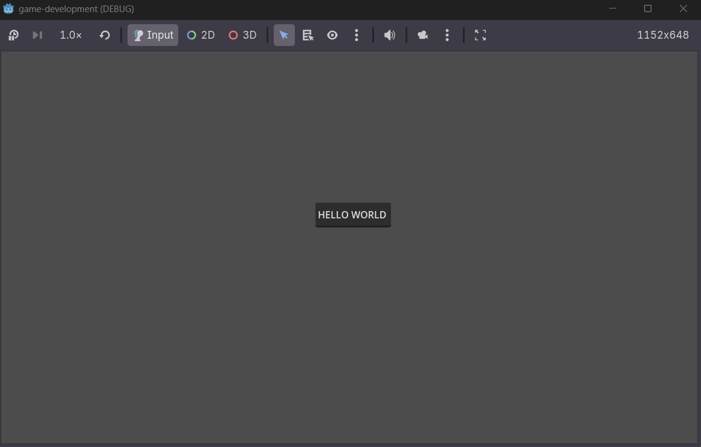

# Simple Scene with a moving node
---

## Instructions
- [ ] create a new godot project. Try to create a simple 2D or 3D project showing "hello world" text.
- [ ] upload to github, update readme.md and put your screenshots and some details of the activity.
- [ ] email me the link to your github project (mention your schedule please)
    my email : mabaricuatro@usc.edu.phz
---
## Sreenshots
