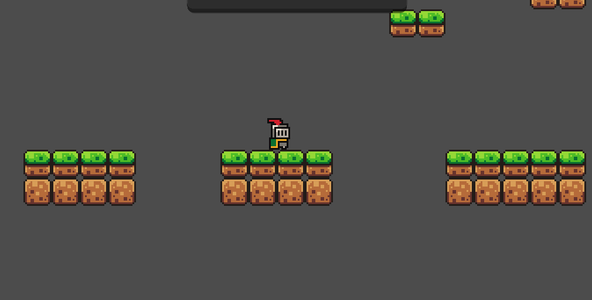

# Week 2 : Activity 1
---

## Gameplay Mechanics

### Subtopics
- [ ] Handling input (keyboard / gamepad)
- [ ] Physics bodies (RigidBody / KinematicBody / CharacterBody)
- [ ] Collision detection
- [ ] Basics of player controllers (movement and jumping)

---

## Instructions
- [ ] Create a new Godot project.
- [ ] Build either:
  - A simple platformer character (move left/right + jump), **or**
  - A dodge mechanic (example: dash with cooldown).
- [ ] Apply physics adjustments (gravity, speed, jump force, friction, etc.) and test different values.
- [ ] Upload your project to GitHub.
- [ ] Update your `README.md` with:
  - Short explanation of your implementation
  - Physics tweaks you tested
  - Challenges you encountered

---
## Demo Video

🔗 https://www.youtube.com/watch?v=RH_-ZIQ7qSM

