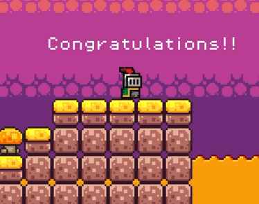

# Week 2 : Activity 2

---

## Level Design

### Subtopics
- [ ] Tilemaps for grid-based levels
- [ ] Adding hazards (spikes / traps)
- [ ] Designing flow (pacing, difficulty curves)

---

## Instructions
- [ ] Design 2 levels for an endless runner (2D or 3D).
- [ ] Level 1 should be noticeably easier than Level 2.
- [ ] Implement traps — no HP system; once caught in a trap, restart from the beginning of the level.
- [ ] Add a notification when entering Level 2.
- [ ] Upload your project to GitHub.
- [ ] Update your `README.md` with:
  - Short explanation of your level designs
  - How you implemented traps and difficulty curves
  - Challenges you encountered

---

## Further Reading
- [Tilemaps Tutorial](https://docs.godotengine.org/en/stable/tutorials/2d/using_tilemaps.html)
- [Level Design Principles](https://www.gamedeveloper.com/design/the-basics-of-level-design)
- [Endless Runner Example](https://docs.godotengine.org/en/stable/tutorials/2d/2d_movement.html)

---

## Demo Video

🔗 https://youtu.be/I-8nVTnJBAY

