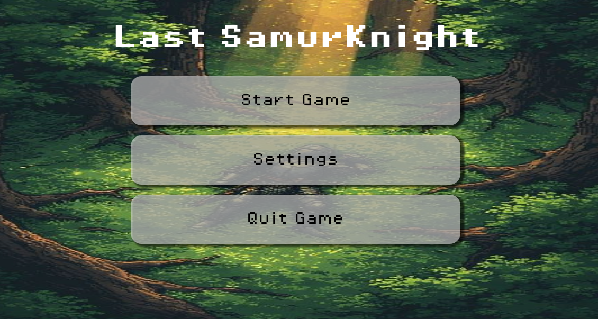

# Week 3 : Activity 1
---

## UI/UX & Audio

### Subtopics
- [ ] HUD elements (health bars, scores)
- [ ] Menu systems (CanvasLayer)
- [ ] Audio buses for mixing SFX / music

---

## Instructions
- [ ] Integrate UI into your game prototype:
  - Health bar
  - Score display or other HUD elements
- [ ] Add sound effects:
  - Walk, run, slash, etc.
- [ ] Optionally add:
  - Game music
  - Introduction screen / menu

---

## Links
- 🔗 [GUI in Godot](#)
- 🔗 [Audio Features](#)
- 🔗 [Audacity Guide](#)

---

## Demo Video

🔗 https://youtu.be/9otIbJyBW9U

---
