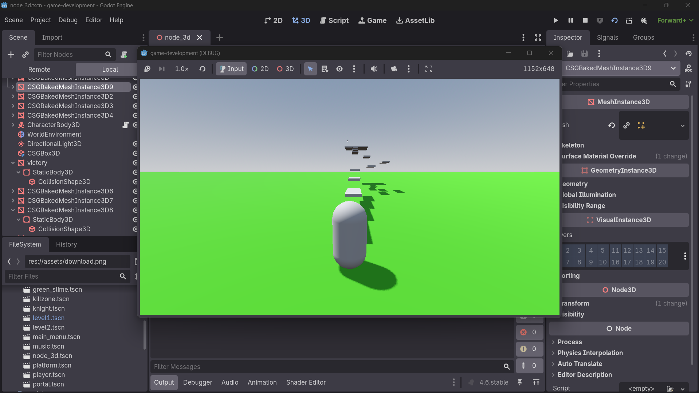

# Week 4 : Activity 1
---

## 3D Basics & Optimization

### Subtopics
- [ ] 3D nodes (meshes, cameras)
- [ ] Lighting (DirectionalLight)
- [ ] Profiling tools for FPS optimization

---

## Instructions
- [ ] Convert your 2D prototype to 3D:
  - Set up 3D nodes and meshes
  - Configure cameras in 3D space
- [ ] Set up lighting:
  - Add DirectionalLight
  - Adjust light settings for your scene
- [ ] Optimize for 60 FPS:
  - Use profiling tools to identify bottlenecks
  - Apply optimization techniques

---

## Links
- 🔗 [3D Introduction](#)
- 🔗 [Optimization Techniques](#)
- 🔗 [Lighting Tutorial](#)

---

## Demo Video

🔗 https://youtu.be/gI9Wp5-G67E

---