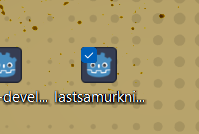

# Week 4 : Activity 2
---

## Multiplatform Export

### Subtopics
- [ ] Exporting for Windows (laptop installer)
- [ ] Exporting for Android (USB / mobile device)
- [ ] Optional: iOS export (Apple device)

---

## Instructions
- [ ] Create a Windows installer for your game:
  - Export as `.exe` for laptop
- [ ] Create an Android build:
  - Export as `.apk`
  - Install via USB to mobile device
- [ ] Optionally try:
  - iOS export if you have an Apple device

---

## Links
- 🔗 [Exporting for Windows](#)
- 🔗 [Exporting for Android](#)
- 🔗 [Exporting for iOS](#)

---

## Demo Video

🔗 

---