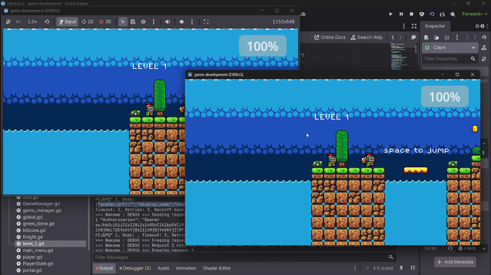

# Week 5 : Activity 1
---

## Multiplayer (Basic Cloud Server)

### Subtopics
- [x] Installing Nakama Godot SDK
- [x] Connecting to Heroic Cloud or local Nakama server (Docker quick-start)
- [x] Device/email authentication
- [x] Creating/joining matches via matchmaking or code
- [x] Using Nakama's relayed multiplayer (socket + match messages)
- [x] Syncing player position/inputs with RPC messages via Nakama

---

## Instructions
- [x] Set up Nakama Godot addon and connect to local Docker Nakama server:
  - Install Nakama addon from GitHub release
  - Run Nakama locally via Docker quick-start
  - Connect client to `127.0.0.1:7350`
- [x] Implement basic authentication:
  - Email/password authentication via `authenticate_email_async`
  - Session token stored and reused per client
- [x] Add a simple lobby/matchmaking screen:
  - Create or join a named match via `join_named_match`
  - Ready button system — game starts when all players are ready
- [x] Sync player position and basic actions between 2 clients:
  - Used `NakamaMultiplayerBridge` for relayed multiplayer
  - Player spawning synced via `static var Players` on `NakamaMultiplayer` class
  - Each player controls their own knight, other players are non-authoritative
- [x] Tested with 2 Godot instances on the same network:
  - Both clients connect, join the same named match, ready up, and load into the level
  - Movement sync working between sessions
  - Disconnect handled gracefully via `onPeerDisconnected`

---

## Links
- 🔗 [Nakama Godot SDK](https://github.com/heroiclabs/nakama-godot)
- 🔗 [Nakama Docker Quick-Start](https://heroiclabs.com/docs/nakama/getting-started/docker-quickstart/)
- 🔗 [Nakama Godot Tutorial Reference](https://github.com/finepointcgi/Nakama-Integration-Tutorial)
- 🔗 [Heroic Cloud](https://heroiclabs.com/heroic-cloud/)

---

## Demo Video

🔗 https://www.youtube.com/watch?v=Etnw_Nudrmw

---